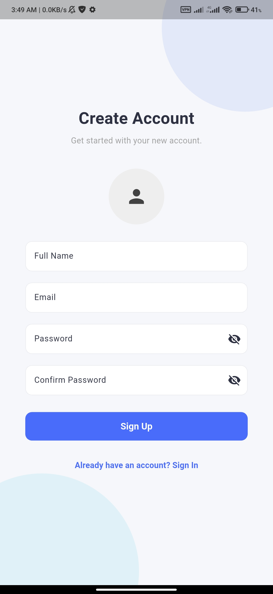
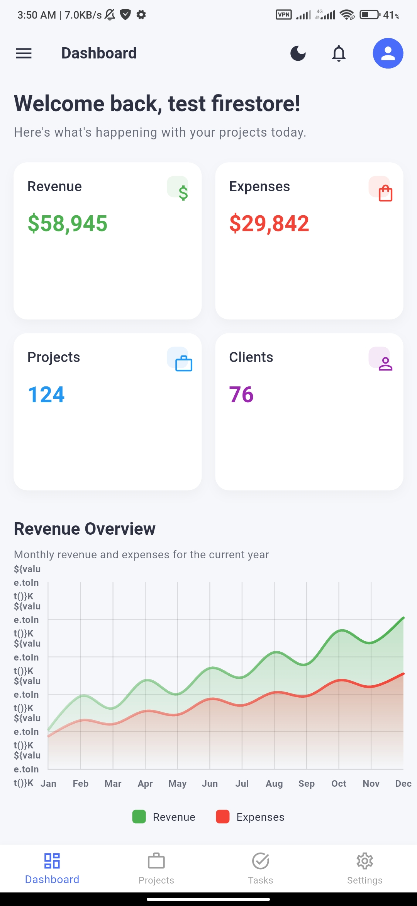
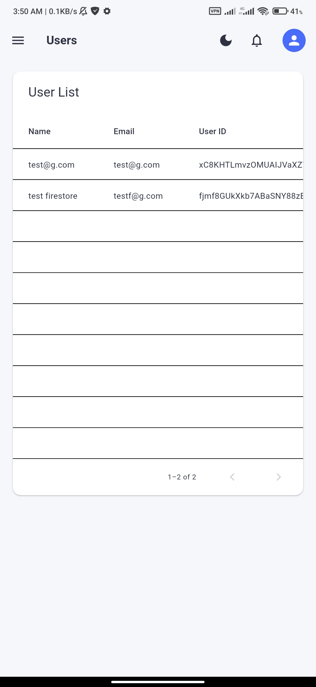
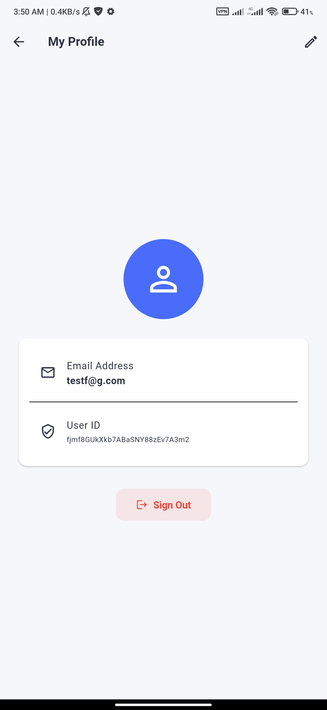
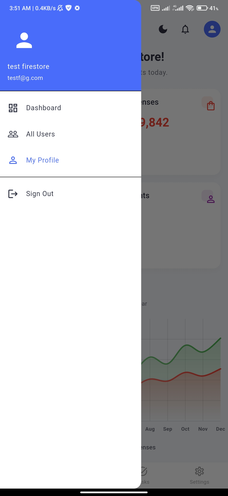
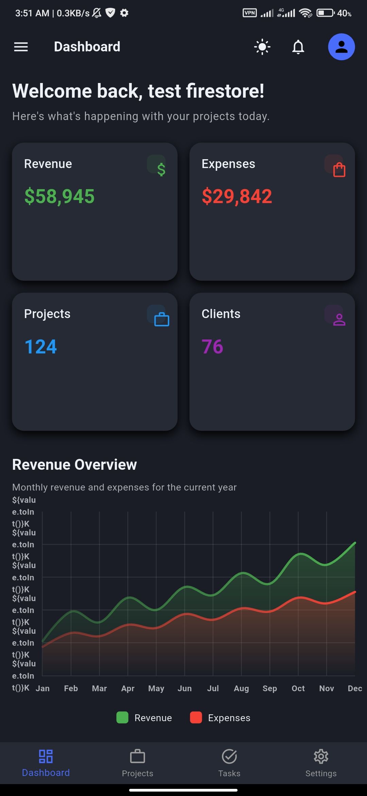
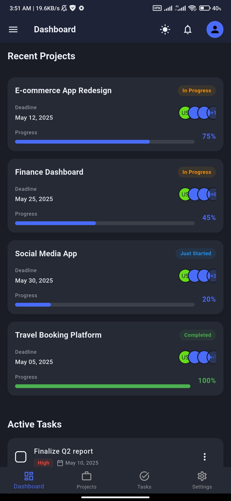

# Flutter Enterprise Boilerplate: Responsive Admin Panel

## 🚀 Overview

This project is a feature-rich, enterprise-grade boilerplate for building scalable and maintainable Flutter applications. It's designed as a **Responsive Admin Panel** but serves as a powerful foundation for any complex Flutter project.

It's built upon **Clean Architecture** principles, ensuring a clear separation of concerns, high testability, and a scalable structure.

---

## ✨ Boilerplate Features

This boilerplate comes pre-configured with essential features for modern application development:

- **✅ Sound Architecture**: Follows **Clean Architecture** with a clear separation into `data`, `domain`, and `presentation` layers for each feature.
- **🔒 Secure Storage**: Uses `flutter_secure_storage` to safely store sensitive data like authentication tokens.
- **🌿 Environment Configuration**: Manages different environments (dev, staging, prod) using `.env` files and `flutter_dotenv`.
- **✍️ Robust Logging**: Integrated with the `logger` package for clear, formatted, and actionable logs.
- **🧪 Comprehensive Testing Setup**: Includes examples for both **Widget Tests** and **Unit Tests** using `flutter_test` and `mocktail`.
- **🔄 CI/CD Ready**: Comes with a pre-configured GitHub Actions workflow to automatically run analysis and tests on every push and pull request.
- **🎨 Advanced Theming**: Supports dynamic light/dark themes with local persistence.
- **🌐 Internationalization (i18n)**: Ready for multi-language support.

## 🛠️ Tech Stack

- **Framework**: Flutter
- **Architecture**: Clean Architecture
- **State Management**: Flutter BLoC + Provider
- **Navigation**: GoRouter
- **Dependency Injection**: GetIt
- **Networking**: Dio
- **Secure Storage**: flutter_secure_storage
- **Environment Config**: flutter_dotenv
- **Logging**: logger
- **Testing**: flutter_test, mocktail
- **Charts**: fl_chart

## 📦 Getting Started

### Prerequisites
- Flutter SDK (stable channel)
- An IDE like VS Code or Android Studio

### Installation & Setup

1.  **Clone the repository**
    ```bash
    git clone https://github.com/yourusername/responsive_admin_panel_flutter.git
    cd responsive_admin_panel_flutter
    ```

2.  **Set up Environment Variables**
    Copy the example `.env` file:
    ```bash
    cp .env.example .env
    ```
    Now, open the `.env` file and add your environment-specific keys (e.g., API URLs).

3.  **Install dependencies**
    ```bash
    flutter pub get
    ```

4.  **(Optional) Firebase Setup**
    If you plan to use Firebase, create a project and add the configuration files as needed.

5.  **Run the app**
    ```bash
    flutter run
    ```

## 🖼️ Screenshots

Berikut adalah tampilan aplikasi Responsive Admin Panel Flutter:

<p align="center">
  
  
  
  
  
  
  
</p>

## 🏗️ Project Structure Explained

The project follows a feature-first, layer-based Clean Architecture.

```
lib/
├── core/                 # Shared code: services, utils, theme, etc.
│   ├── storage/          # SecureStorageService abstraction
│   └── utils/            # AppLogger and other utilities
│
├── features/             # Each feature is a self-contained module
│   └── user/             # Example: User feature
│       ├── data/         # Data layer
│       │   ├── data_sources/ # Remote (API) or Local (DB) data sources
│       │   ├── models/       # Data Transfer Objects (DTOs)
│       │   └── repositories/ # Implementation of the domain repository
│       │
│       ├── domain/       # Domain layer (business logic)
│       │   ├── entities/     # Plain Dart objects representing core business models
│       │   ├── repositories/ # Abstract contracts for data layer
│       │   └── use_cases/    # Individual business actions
│       │
│       └── presentation/ # Presentation layer (UI)
│           ├── cubit/      # State management (BLoCs/Cubits)
│           ├── pages/      # Screens/Pages
│           └── widgets/    # Reusable widgets for this feature
│
├── injection.dart        # Dependency injection setup (GetIt)
└── main.dart             # App entry point
```

## 🧪 Testing

This boilerplate is configured for comprehensive testing.

-   **Run all tests:**
    ```bash
    flutter test
    ```

-   **Unit Tests**: Located in `test/features/**/domain/`. They test the business logic in isolation. See `get_user_use_case_test.dart` for an example.
-   **Widget Tests**: Located in `test/`. They test individual widgets. See `widget_test.dart` for an example.

## 🤝 Contributing

Contributions are welcome! Please feel free to submit a Pull Request. Ensure that your code passes the CI checks (`flutter analyze` and `flutter test`).

## 📄 License

This project is licensed under the MIT License - see the [LICENSE](LICENSE) file for details.
